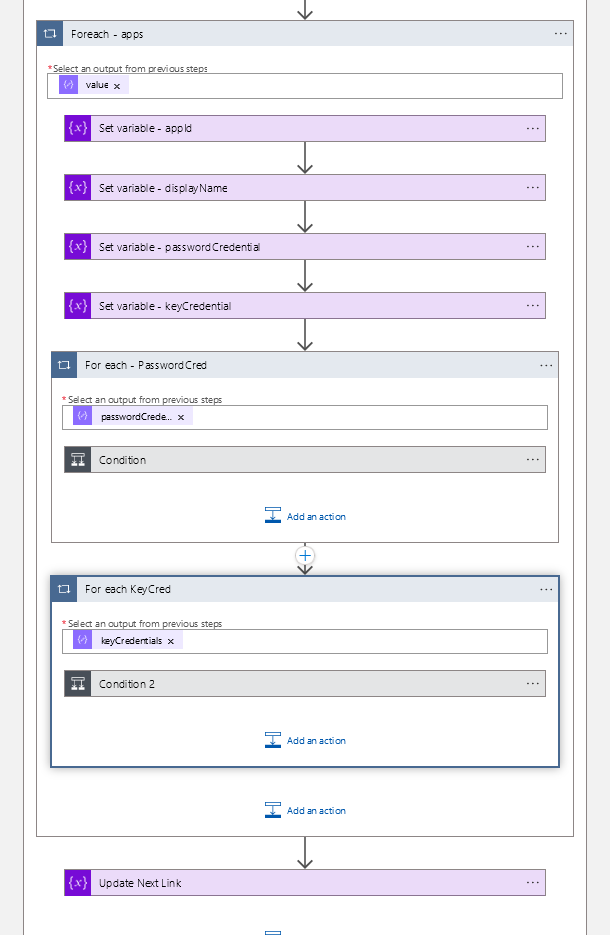

# CI/CD Pipeline to deploy a Logic App using Bicep

**NOTE:** To self-demo this CI/CD pipeline see the section **Self-Demonstration** at the end of this document.

## Introduction

Azure Logic App to notify administrators of pending Azure Active Directory Application Client Secrets and Certificate Expirations. This application is deployed using a CI/CD pipeline that uses a Bicep file to generate a ARM Template that, when pushed to the repository, will trigger off the pipeline.

This repository houses the ARM template to deploy the logic app infrastructure to alert you via email when a Azure Active Directory Application Secret is going to expire.

The email will contain the following information when a secret is close to expiration.


## Prerequisites

### AAD Application Registration

Create, or use an existing, Azure Active Directory Application Registration that has one of the following permissions. The following list is from most permissive to most restrictive:

1. `Application.Read.All`
2. `Application.ReadWrite.All`
3. `Directory.Read.All`
4. `Directory.AccessAsUser.All`

Below is what your Azure Active Directory Application Registration would look like if you assigned all of the above permissions. (Not recommended for production.)


### Azure CLI

Azure CLI of at least version 2.20 (as per Microsoft documentation). This project has been developed with the fversion 2.36 for the Azure CLI. 

You can find the Azure CLI software to download [here](https://docs.microsoft.com/en-us/cli/azure/install-azure-cli)

```powershell
PS C:\azure-aad-application-secrets-notification> az --version
azure-cli                         2.36.0

core                              2.36.0
telemetry                          1.0.6

Extensions:
application-insights              0.1.14

Dependencies:
msal                              1.17.0
azure-mgmt-resource               20.0.0

Python location 'C:\Program Files (x86)\Microsoft SDKs\Azure\CLI2\python.exe'
Extensions directory 'C:\Users\gregory.mirsky\.azure\cliextensions'

Python (Windows) 3.10.4 (tags/v3.10.4:9d38120, Mar 23 2022, 22:57:10) [MSC v.1929 32 bit (Intel)]

Legal docs and information: aka.ms/AzureCliLegal


Your CLI is up-to-date.

Please let us know how we are doing: https://aka.ms/azureclihats
and let us know if you're interested in trying out our newest features: https://aka.ms/CLIUXstudy
PS C:\azure-aad-application-secrets-notification>
```

### Azure Bicep

Azure Bicep version of v0.5.6 or higher. This project was developed with version v0.5.6 but upgraded to version v0.6.1

```powershell
PS C:\azure-aad-application-secrets-notification> az bicep version
A new Bicep release is available: v0.6.1. Upgrade now by running "az bicep upgrade".
Bicep CLI version 0.5.6 (5f2f88f0f0)

PS C:\azure-aad-application-secrets-notification> az bicep upgrade
Installing Bicep CLI v0.6.1...
Successfully installed Bicep CLI to ".\.azure\bin\bicep.exe".
PS C:\azure-aad-application-secrets-notification>
```

### VS Code Extension (Optional)

It is recommend, but not mandatory, that you install the latest VS Code Extension for Bicep


## Azure Devops Pipeline

The code for the Azure DevOps Pipeline is located in the file: `azure-pipelines.yml`

The Azure DevOps Pipeline for this project is broken up into two stages, "validateandtest" and "Deploy".

The steps for each stage are as follows:


When a new version of the ARM template is pushed to the repository, the first stage, "validateandtest", will validate the ARM template generated by Bicep, check the assets that are already deployed in the target Azure Resource Group and then test to see if any assets will be deleted. If there is a Azure asset that will be deleted, the pipeline will halt so that no assets are accidentally deleted.

The second stage will then use the validated and checked ARM template to deploy new assets or changes to the target resource group.

### Post-Deployment (first time deployment only)

Perform the following steps to finalize the implementation of this solution after a fresh deployment:

1. Open the target resource group in the Azure console.
2. Click the API Connection called `Office365`
3. Click `Edit API Connection` on the left panel
4. Click `Authorize`, then login when prompted, and click `Save`
5. Repeat the same steps for the `keyvault` API connection.
6. Click `Logic App Designer`
7. Click Run Trigger to test the logic app.

## Logic App Flow

This is the overall Logic App flow


Exploded view of the until loop


Further drill down into the for each loop for the password credentials



The password credential loop conditional statement


The key credentials conditional statement


For more detailed information on each step please consult the Azure Logic App designer or the `template.json` file in this repository.

## Self-Demonstration

To self demonstrate the CI/CD pipeline complete the following steps. 

In this demonstration we will add a new tag to be added to all of the Azure assets that have been deployed in the resource group.

#### Update the Bicep file

Using the Microsoft VS Code editor, open up the file `template.bicep` and find the parameter called `tags`

```bicep
@description('Tags to be applied to the provisioned Azure assets')
param tags object = {
  Environment: 'QA'
  Bicep_Managed: true
  Owner: 'Me, Myself & I'
}
```

Add a test tag. We have added a tag called `TestTag01` with a value of `Delete me!` in the sample below. Feel free to add any tag you wish, just leave the tags for `Environment`, `Bicep_Managed`, and `Owner` alone.

```bicep
@description('Tags to be applied to the provisioned Azure assets')
param tags object = {
  Environment: 'QA'
  Bicep_Managed: true
  Owner: 'Me, Myself & I'
  TestTag01: 'Feel free to delete me!'
}
```

Save the file.

#### Create ARM template

Now we will create the Azure Resource Manager (ARM) template from the Bicep file. We have two options to generate the ARM template. The easiest is using the VS Code option.

##### Create ARM template from Bicep using VS Code

In the Microsoft VS Code editor, right click the file `template.bicep` and select `Build Bicep File` `(CTRL+Shift+B)`. This will generate a new copy of the `template.json` file that is a Azure Resource Manager (ARM) template.

##### Create ARM template from Bicep using Azure CLI command line

To generate Azure Resource Manager (ARM) template from the Bicep file using the Azure CLI, first you need to log on to Azure with the Azure CLI using the command `az login`. Next, we use the `az bicep build` command where we specify the input file and the output file.

```powershell
PS C:\azure-aad-application-secrets-notification> az login
A web browser has been opened at https://login.microsoftonline.com/organizations/oauth2/v2.0/authorize. Please continue the login in the web browser. If no web browser is available or if the web browser fails to open, use device code flow with `az login --use-device-code`.
[
  {
    "cloudName": "AzureCloud",
    "homeTenantId": "44f50e82-2836-43d7-8098-42f27530458b",
    "id": "ec118674-3721-666d-b678-e82801a3a6ff",
    "isDefault": true,
    "managedByTenants": [],
    "name": "Azure subscription 1",
    "state": "Enabled",
    "tenantId": "44f50e82-2836-43d7-8098-42f27530458b",
    "user": {
      "name": "some_user@somedomain.net",
      "type": "user"
    }
  }
]
PS C:\azure-aad-application-secrets-notification> az bicep build --file .\template.bicep --outfile .\template.json
```

##### Push the changes to the repository. 

Push the changes to `template.bicep` and `template.json` to the repository to trigger off the Azure DevOps pipeline.

If you go to Azure DevOps Pipelines you can see the pipeline starting up.


When the pipeline finishes, the pipeline should look like this.


Let's check the tags on the objects to see that our tags populated by inspecting a few of the objects in the resource group.


As you can see, the tag were added has been applied.

##### Rinse & Repeat

Now let's clean up the tags by repeating the process, this time we will delete the tag we created from the Bicep file, regenerate the ARM template and then commit the changes to the repository.
